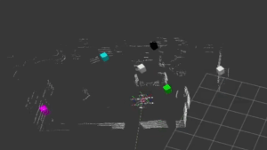
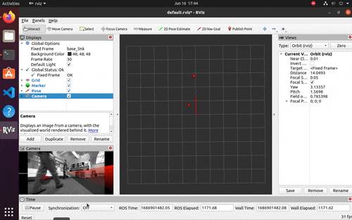
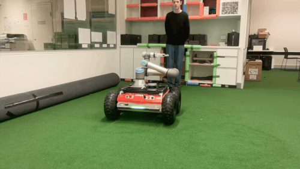

# Project Overview

Using Husarion Panther to

[1] Detect Objects using Filtered PointCloud2 |  [2] Detect and Track People using ZED 2i |[3] Use Velocity Control to Move to Target Person
:---------------------------:|:-------------------------:|:-------------------------:
  |   | 


* [1] - Demonstrates Gradually Gaining Confidence in Object Detection and then Maintains Object Tracking despite Overlapping Clusters. (Resource - Multiple Object Tracking Lidar: https://github.com/praveen-palanisamy/multiple-object-tracking-lidar)
* [2] - Detecting People using ZED2 3D Object Detection using the Position of Objects labelled ('Person') over a Defined Detection Confidence threshold. (Resource - Object Detection Model: https://www.stereolabs.com/docs/ros/object-detection/)
* [3] - Target Person is defined as the closest person detected on program start, and velocity control commands ensure target stays in focus of camera and maintains a safe distance away.

# Team Members

* Alec Sathiyamoorthy (s3937453)
* Gao Fan (s3734811)
* Mitchell Gust (s3782095)
* Utkarsh Agarwal (s3932349)

# Tim's Panther Development Instructions 

1. Stop all containers on dot 3 before shut down
1. Ensure the arm is off before shut down
1. Never run the bot with the power cable connected
1. Wait for full shutdown and restart
1. Software E-Lock can be disabled through **10.15.20.2:8000**

# Questions - 

1. How do you safely shutdown the panther?

> According to husarion documentation 
> https://husarion.com/manuals/panther/

> We press the power button and wait for the power button to stop blinking. Once it stops blinking you can disconnect the battery.

1. How do we know if the arm is on/off?

> According to the UR5e manual, the Robot arm itself has a state indicator either red, yellow, or green indicating that it's on. 

1. How do we shutdown the arm?

# Startup procedure

1. Remove charging cable
1. Turn battery switch to on
1. Turn on power
1. Disable hardware lock (big red knob on the back of the bot)
1. Disable software lock, go to **10.15.20.2:8000** and press the button

# Connecting to the bot

1. Connect to the Panther network
1. ssh into ```ssh husarion@10.15.20.3``` or .2 if you want to connect to the pi.


# Shutdown procedure

1. Connect to the dot 3 ```ssh husarion@10.15.20.3```
1. Check which containers are active ```docker ps```
1. Shutdown all docker containers ```docker stop $(docker ps -a -q)```
1. Ensure all docker containers have stopped ```docker ps```
1. Check the arm is off ```rostopic list``` and confirm UR5e is not running
1. Press the power button to initiate the shutdown sequence
1. When the power button stops blinking
1. Move battery switch to off position
1. Connect charging cable

> Use ```docker ps -a``` to see all containers.


Default LED Behaviour : https://husarion.com/manuals/panther/#animations


# Activating the Velodyne

1. Connect to dot 3 ```ssh husarion@10.15.20.3```
1. cd into the velodyne panther folder ```cd velodyne-docker/panther_velodyne/```
1. Start all docker containers ```docker compose up``'
1. Check if the velodyne container is running using ```docker ps```
1. ~Use docker start to start the velodyne ```docker start velodyne```~

**Run rviz***

1. Open a new terminal
1. set ros master ```set_ros_master 10.15.20.2```
1. rosrun rviz ```rosrun rviz rviz```


# Docker Commands

```sh
# Stop container.
docker stop CONTAINER

# Turn off auto restart.
docker update --restart=no CONTAINER

# Delete container.
docker rm CONTAINER

# Delete docker image.
docker image rm IMAGE

```


# Run Panther Tracking

## Build the image

**This only needs to be done once!!!**

The image only needs to be built once. Once built you can link the image to the container.

1. cd into our source directory ```cd par-a3-dot2```
1. build the docker image ```docker build -t panther_tracking:noetic .```

## Run the compose file

We have provided a compose file that runs our service, see **docker-compose/compose-panther-tracking.yaml** file

1. Get the image name and tag ```docker images```
1. Note down the **REPOSITORY** and **TAG** for our docker image, this will be needed later
1. Navigate to the compose file folder ```cd par-a3-dot2/docker-compose```
1. Verify the contents of the compose file ```cat compose-panther-tracking.yaml``` and ```cat compose-panther-firstpkg.yaml```
1. Our service is the **panther_tracking** service, the image is specified as **REPOSITORY:TAG**, in our case it should be something like **pather_tracking:noetic**
1. Once the content has been verified, run the following script to compose the first package file ```docker compose --project-name rmit_panther_firstpkg -f compose-panther-firstpkg.yaml up```
1. Then in a new terminal navigate to the **docker-compose** folder and run ```docker compose --project-name rmit_panther_tracking -f compose-panther-tracking.yaml up```

> Note, if you have run this correctly then you wont have to remove the docker container and recreate it.
